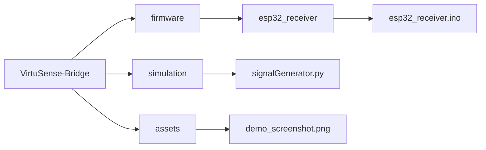

# VirtuSense Bridge: Industrial IoT Digital Twin & HIL Simulation


**VirtuSense Bridge** is an end-to-end Industrial IoT architecture designed to simulate, detect, and visualize machinery faults without risking expensive physical assets. This repository contains the **Hardware-in-the-Loop (HIL)** simulation module, connecting a Python-based Digital Twin to an ESP32 Edge Device via MQTT.

---

## System Architecture

The system operates on a "Virtual Sensor" architecture, injecting synthetic voltage data into an embedded microcontroller to verify firmware logic before deployment.

```mermaid
graph LR
    A[Python Digital Twin] -- Synthetic Telemetry --> B(MQTT Broker)
    B -- Signal Injection --> C[ESP32 Edge Firmware]
    C -- Threshold Logic --> D{State Detection}
    D -- Normal --> E[Green LED (Safe)]
    D -- Anomaly --> F[Red LED (Danger)]
    D -- Idle --> G[Blue LED (Standby)]
```

## Key Features

#### 1. The Digital Twin (Signal Generator):
A Python script (generator.py) that mathematically models motor vibrations. It generates three distinct signal patterns:
    **Normal Operation**: Smooth Sine Wave (simulating a healthy rotating shaft).
    **Anomaly**: Stochastic High-Amplitude Noise (simulating bearing failure or cavitation).
    **Idle**: Low-amplitude background noise.

#### 2. The Edge Receiver (ESP32 Firmware):
The firmware *(esp32_receiver.ino)* treats the incoming MQTT payload as a virtual ADC (Analog-to-Digital Converter) reading. It processes the signal in real-time (sub-50ms latency) to trigger visual indicators.

#### 3. Real-Time Logic & Actuation
The system classifies machine health based on dynamic thresholds:
| State | Signal Value | Visual Indicator | Condition |
| :--- | :--- | :--- | :--- |
| Idle | < 900 | 🔵 Blue LED | Machine Standby |
| Normal | 900 - 3500 | 🟢 Green LED | Optimal Operation |
| Fault | > 3500 or < 300 | 🔴 Red LED | Critical Failure / Spike |

## Tech Stack
Language: Python 3.11, C++ (Arduino Framework)
Communication: MQTT Protocol (HiveMQ Public Broker)
Simulation Environment: Wokwi (ESP32 Virtualization) / Physical ESP32
Libraries:
Python: paho-mqtt
Arduino: PubSubClient, WiFi

## Project Structure


## How to Run the Simulation

#### Step 1: Hardware Setup
If using a physical ESP32 or Wokwi Simulator, connect LEDs to the following GPIO pins:
*Red LED (Fault): GPIO 13*
*Green LED (Normal): GPIO 12*
*Blue LED (Idle): GPIO 14*

#### Step 2: Firmware Deployment
Open firmware/esp32_receiver.ino in Arduino IDE or Wokwi.
Configure WiFi credentials and MQTT broker settings in the code.
Install the PubSubClient library.
Upload to ESP32.
Verify: The Blue LED should light up as the device connects to WiFi.

#### Step 3: Python Environment
Ensure Python 3.11+ is installed.
Install dependencies:
```bash
pip install paho-mqtt numpy
```
#### Step 4: Run the Signal Generator
Execute the generator script:
```bash
python simulation/generator.py
```
Monitor the ESP32 LEDs to observe state changes based on the synthetic telemetry.
Use the interactive terminal to control the machine state:
Type n and press Enter: Sends Normal Sine Wave (Green LED).
Type a and press Enter: Sends Anomaly Spikes (Red LED flashes).
Type i and press Enter: Sends Idle Noise (Blue LED).

## Author
Developed by [Shahil Patel]
(Embedded Systems & AI Engineer, Bharat Electronics Limited | IIT Dharwad Alumnus
Focus: Industrial IoT, Edge AI, and System Architecture)